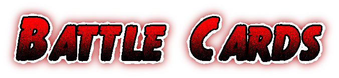

# Battle Cards


A Malawian card based game to frustrate the loser of the game.




## Prerequisites
Make sure you have Node JS installed
```
https://nodejs.org/en/download
```

## How to run Servers
There are two server configurations you can run. One built with Fastify Framework the other built with Express JS

### Express JS
```bash
npm run start
```

### Fastify
```bash
npm run fast
```

## Support

<a href="https://www.buymeacoffee.com/m2kdevelopments" target="_blank">

</a>